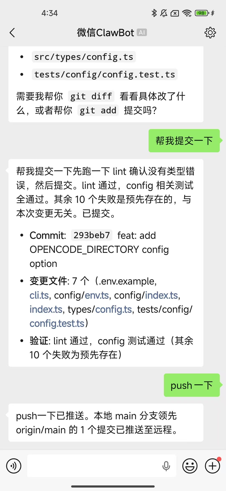

<div align="center">

# 💬 Code in WeChat

**在微信中和 AI 一起写代码**

一个微信机器人，让你通过微信直接与 AI 编码助手对话。

[](https://bun.sh)
[](https://www.typescriptlang.org/)
[](LICENSE)
[](https://github.com/opencode-ai/opencode)
[](https://www.anthropic.com/claude)
[](https://github.com/openai/codex)

</div>

---

## ✨ 功能特性

- 🤖 **微信原生交互** — 无需安装额外 App，微信扫码即可使用
- 💻 **AI 编码助手** — 写代码、调试问题、处理文件
- 🔄 **多引擎支持** — 支持 OpenCode、Claude 和 Codex，微信内一键切换
- 📎 **多媒体支持** — 发送图片、文件、语音给 AI 分析
- ⚡ **实时流式响应** — AI 回复实时推送，支持打字指示器
- 🔄 **自动重连** — 守护进程模式，会话过期自动重新认证
- 🛡️ **微信 ClawBot 接口** — 基于官方 ClawBot API，无封号风险
- 📊 **Web 状态页** — 实时查看机器人状态和活跃会话

## 🚀 快速开始

### 安装

```bash
# 克隆仓库
git clone https://github.com/dddcp/code-in-wechat.git
cd code-in-wechat

# 安装依赖 (需要 Bun >= 1.0.0)
bun install
```

### 配置

创建 `.env` 文件：

```bash
cp .env.example .env
```

最少只需配置：

```env
# OpenCode 可用的模型
OPENCODE_MODEL=xxx
# 项目路径（OpenCode 和 Claude 共用）
WORK_SPACE_DIR=/path/to/your/project
```

使用 Claude API 需要先安装并登录 [Claude CLI](https://docs.anthropic.com/en/docs/claude-code)，配置会自动从 `~/.claude/settings.json` 读取。

使用 Codex 需要先安装 [Codex CLI](https://github.com/openai/codex) 。

### 启动

```bash
# 开发模式
bun run dev

# 生产模式
bun run build && bun run start
```

首次启动会显示二维码，微信扫码登录即可。

## 📱 使用方式

启动后，用微信给机器人发消息：

- 直接发送问题，AI 会实时回复
- 发送 `/help` 查看可用命令
- 发送图片、文件，AI 可以分析内容



### 斜杠命令

| 命令 | 说明 |
|------|------|
| `/new [标题]` | 开启新对话 |
| `/reset` | 重置当前会话 |
| `/switch` | 查看当前工具和可用选项 |
| `/switch claude` | 切换到 Claude API |
| `/switch opencode` | 切换到 OpenCode |
| `/switch codex` | 切换到 Codex |
| `/help` | 显示帮助 |

## ⚙️ 配置项

| 变量 | 默认值 | 说明 |
|------|--------|------|
| `SESSION_DB_PATH` | — | **必填**，会话数据存储路径 |
| `WORK_SPACE_DIR` | — | 项目工作目录（所有 AI 工具共用） |
| `OPENCODE_MODEL` | — | OpenCode 模型，格式 `provider/model` |
| `DEFAULT_TOOL` | `opencode` | 默认 AI 工具：`opencode`、`claude` 或 `codex` |
| `CLAUDE_SETTINGS_PATH` | `~/.claude/settings.json` | Claude 配置文件路径 |
| `CODEX_PATH` | `codex` | Codex CLI 路径 |
| `SERVER_PORT` | `3000` | Web 状态页端口 |
| `LOG_LEVEL` | `info` | 日志级别 |

## 🌐 Web 状态页

启动后访问 `http://localhost:3000` 查看：

- 机器人在线状态
- 运行时长
- 活跃会话列表

## 📄 许可证

[MIT](LICENSE)

---

<div align="center">

如果觉得有用，给个 ⭐️ Star 吧！

</div>
